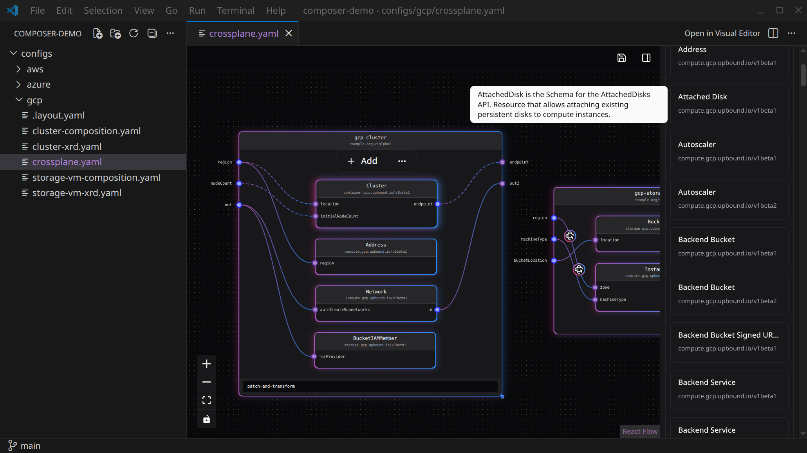

# Overlock Studio Composer for VSCode

> Visual, node-based editor for configuration files, right inside VS Code.

<!-- Replace the screenshot above with a usage video (GIF/MP4) once available. -->

## What it does

Open complex configuration files in a graph view instead of plain text. Resources and the connections between them are rendered as nodes you can drag, connect, and edit. Every change writes back to the original file format on disk, with no proprietary format and no lock-in.

Node positions live in a sibling `.layout.yaml`, so the canvas you arrange today is the canvas you see tomorrow.

The extension is built around a pluggable format registry. **Crossplane is the first supported format; Terraform, Argo Workflows, and Akash Network SDL are coming next.**

## Features

- **Graph view of the whole configuration.** Sibling files in the same folder are loaded together so you see the full picture, not one file at a time.
- **Round-trips to the source format.** Edit visually, save, and your files reflect the changes: diff-friendly and reviewable.
- **Layout persistence.** Node positions are stored next to your config, ready to commit alongside it.
- **Conflict-safe saves.** If a file changed on disk while you were editing, the extension opens a diff view (`<file> ↔ Overlock Composer (pending)`) instead of overwriting your work.
- **Live reload.** External edits (another editor, `git checkout`, etc.) are picked up automatically.
- **Block schemas from OCI.** Provider/function block types are fetched by the extension host so auth and CORS don't get in the way.

## Quick start

1. Install the extension.
2. Open a folder containing a supported configuration file (currently `crossplane.yaml`).
3. Right-click the file in the Explorer → **Open in Visual Editor** (or use the editor title bar button, or run **Overlock Studio Composer: Open in Visual Editor** from the Command Palette).
4. Edit on the canvas. `Ctrl+S` / `Cmd+S` saves both the source files and the layout.

The custom editor is registered with `priority: option`, so the plain text editor remains the default. Switch back and forth via **Reopen Editor With…** any time.

## Supported formats

| Format | Files | Status |
| --- | --- | --- |
| Crossplane | `crossplane.yaml`, `crossplane.yml` | Available |
| Terraform | `*.tf` | Planned |
| Argo Workflows | `*.yaml` (workflow specs) | Planned |
| Akash Network SDL | `deploy.yaml` (SDL) | Planned |

Want another format supported? [Open an issue.](https://github.com/overlock-studio/composer-vsce/issues)

## Feedback

Found a bug? Have a format you'd like supported? Open an issue at [github.com/overlock-studio/composer-vsce](https://github.com/overlock-studio/composer-vsce/issues).
